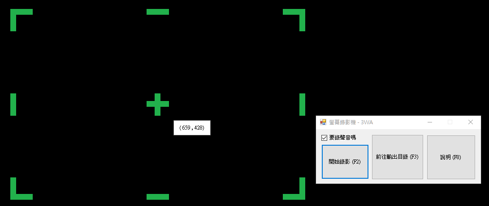

# my_cam_ocr
標題：我的自製簡易版桌面螢幕文字OCR 
功能： 
　　如對著螢幕上的影片，定義好要進行影像辨識的區域， 
按下開始，就會生成 srt 文字檔，通常用於有字幕的新聞台、綜藝節目，卡通影片。 
　　但時間是從按下開始瞬間當作。 
作者：羽山秋人 (http://3wa.tw) 
版本：V0.1 (2019-11-29) 
 
 
相關技術： 
tesseract OCR 文字辨識 

  
   
  操作界面

 
Todo： 
